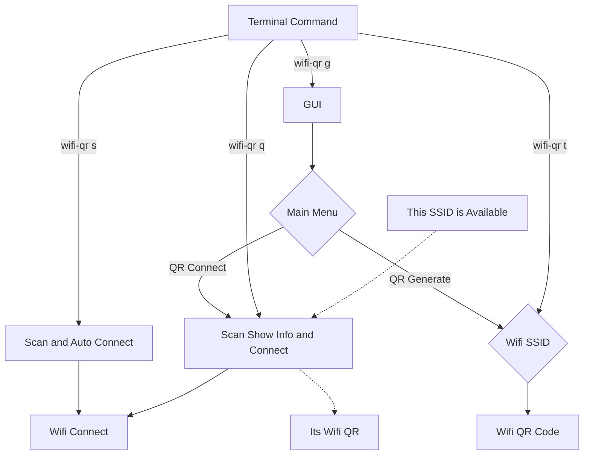

# Wifi QR 

Hi everyone 
i am think about Xiaomi Phone Wifi, Hotspot Share with QR, 
also scan with auto connect to WIFI.
now i did it, **wifi-qr**. 
we can do like Xiaomi Phone.
using zbarcam via zbar-tools and qrencode.

## v0.1.1 is using bash reading replace with nmcli

## Generate WIFI QR
it's easy, 
we check ``/etc/NetworkManager/system-connections`` and generate WPA, WEP and Open, also HIDDEN network.
> now using nmcli
you can use command line via
* ``sudo wifi-qr t`` for terminal only QR.
* ``sudo wifi-qr g`` for PNG file QR export.
or using graphics menu.
* ``Share saved WiFi``

## Scan and Connect with QR Code
It's like Android QR Scanner,  scan and connect to network.
*iOS is just see password*
from terminal 
* ``sudo wifi-qr s`` for auto connect.
* ``sudo wifi-qr q`` for show SSID, PASS and Connect.
or using graphics menu
* ``Scan and connect``


## Todo list
- [x] QR Generate with GUI
- [x] QR Generate with Terminal 
- [x] QR Scan and Auto Connect
- [x] It's Not Wifi QR
- [x] This network is not available. 
- [x] Migration to nmcli
- [x] QR Share Hidden Network
- [x] QR Scan Auto Connect Hidden Network
- [ ] icons
- [ ] Additional LDAP Login

###  Improve
 All is done
 Just need for LDAP and LEAP
 

```
nmcli c add type wifi con-name <connect name> ifname wlan0 ssid <ssid>
nmcli con modify <connect name> wifi-sec.key-mgmt wpa-psk
nmcli con modify <connect name> wifi-sec.psk <password> 
nmcli con up <connect name>
```

## UML diagrams

WIFI QR UML.


