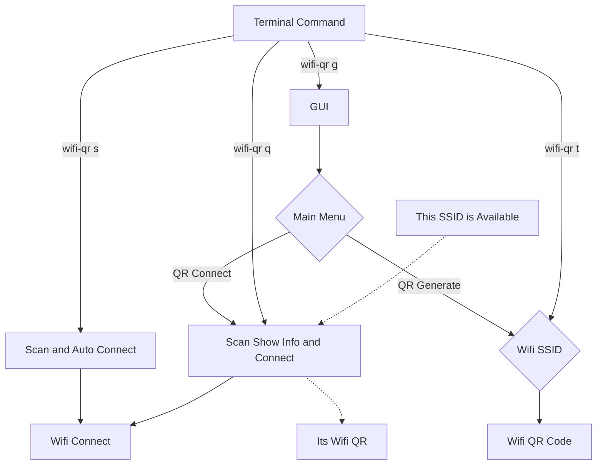

# Wifi QR 
 
## WiFi Share and Connect with QR

 Xiaomi Android phones has started using QR to use WiFi for sharing.
 The idea was to get started with Bash, from Android to PC or PC to
 Mobile, and use Interface for zenity, QR for zbar and qrencode,
 and nmcli from Network-Manager for Network. For security,
 you can use WPA, WPA2, WEP, Open and share with the Hidden Network.
 QR code does not support LDAP Network and VPN.
 Android can easily generate WiFi QR, but iOS isn't quite so sure.


## Contributor 

@BT-mfasola - Arrary Redesign

@i-need-to-tell-you-something - Grammer and Typo Fix

@Pabs3 - Shellcheck Recommend  

@Baco - README update for sudo remove

@naing2victor - Assistant 

@waiyanwinhtain - Tester and Bug Report

@hosiet - Mentor and Sponsor for Debian

@paddatrapper- Mentor and Sponsor for Debian

- Sorry for Code Clean, Rebase and force upload.

## v0.1-1 is using bash reading replace with nmcli
## v0.1-2 shellcheck pass for #9

## Generate WIFI QR
it's easy, 
we check ``/etc/NetworkManager/system-connections`` and generate WPA, WEP and Open, also HIDDEN network.
> now using nmcli
you can use command line via
* ``wifi-qr t`` for terminal only QR.
* ``wifi-qr g`` for PNG file QR export.
or using graphics menu.
* ``Share saved WiFi``

## Scan and Connect with QR Code
It's like Android QR Scanner,  scan and connect to network.
*iOS is just see password*
from terminal 
* ``wifi-qr s`` for auto connect.
* ``wifi-qr q`` for show SSID, PASS and Connect.
or using graphics menu
* ``Scan and connect``


## Todo list
- [x] QR Generate with GUI
- [x] QR Generate with Terminal 
- [x] QR Scan and Auto Connect
- [x] It's Not Wifi QR
- [x] This network is not available. 
- [x] Migration to nmcli
- [x] QR Share Hidden Network
- [x] QR Scan Auto Connect Hidden Network
- [x] icons
- [ ] Additional LDAP Login

###  Improve
 All is done
 Just need for LDAP and LEAP
 We will come back when QR Code and Scanner support LDAP and relative thing.
 

```
nmcli c add type wifi con-name <connect name> ifname wlan0 ssid <ssid>
nmcli con modify <connect name> wifi-sec.key-mgmt wpa-psk
nmcli con modify <connect name> wifi-sec.psk <password> 
nmcli con up <connect name>
```

## UML diagrams

WIFI QR UML.


