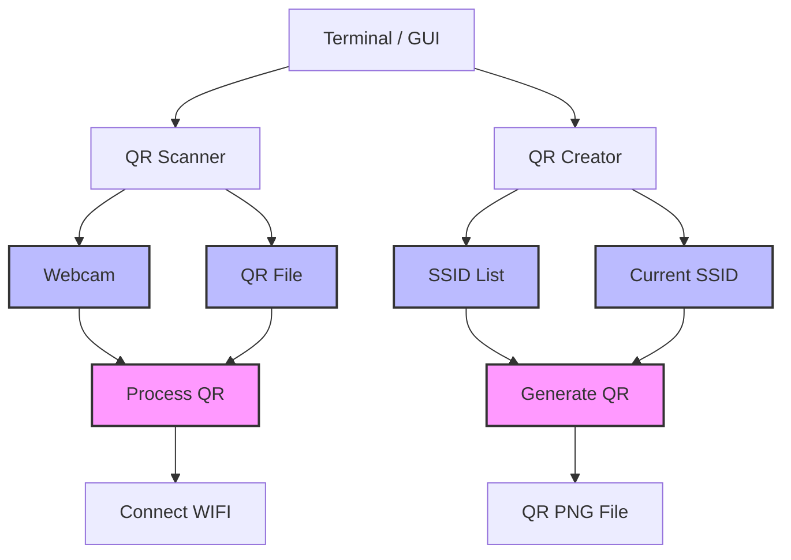

  ## WiFi Share and Connect with QR

 Xiaomi Android phones has started using QR to use WiFi for sharing.
 
 The idea was to get started with Bash, from Android to PC or PC to
 
 Mobile, and use Interface for zenity, QR for zbar and qrencode,
 
 and nmcli from Network-Manager for Network. For security,
 
 you can use WPA, WPA2, WEP, Open and share with the Hidden Network.
 
 QR code does not support LDAP Network and VPN.
 
 Android can easily generate WiFi QR, iOS via Shortcuts apps.


## Usage

### Generate WIFI QR

It's easy to generate QR codes for WiFi networks by checking `/etc/NetworkManager/system-connections` to generate WPA, WEP, Open, and even HIDDEN networks using `nmcli`.

You can generate QR codes using:

-   Command line:
    
    -   `wifi-qr -t` to launch WiFi QR creation from the terminal.
    -   `wifi-qr -c` to launch WiFi QR creation using a GUI.
    -   `wifi-qr -z` to use the terminal with a fuzzy finder for network selection.
-   Graphical interface:
    
    -   `wifi-qr -g` to launch the main menu GUI for various operations including QR generation.

### Scan and Connect with QR Code

Functioning like an Android QR scanner, this allows scanning and automatically connecting to networks. iOS users can see the password but need to manually connect.

You can scan and connect using:

-   Command line:
    
    -   `wifi-qr -s` for scanning a QR and auto-connecting to WiFi.
    -   `wifi-qr -f [file]` to scan a QR from a file and auto-connect to WiFi.
-   Graphical interface:
    
    -   `wifi-qr -p` to launch a GUI for scanning a QR from a file and connecting to WiFi.
    -   `wifi-qr -q` to scan and connect to WiFi directly from the GUI.

### Webcam Selector and Config

Select and configure a webcam for use with WiFi QR operations. This option will allow you to use your webcam to scan WiFi QR codes directly.

-   Command line:
    -   `wifi-qr -w` to select and configure your webcam for scanning QR codes.

### Additional Commands

-   `wifi-qr -L` Use legacy (backslash) encoding/decoding.
-   `wifi-qr -v` Display the version of WiFi-QR (Version 0.3).
-   `wifi-qr -h` Show the help message.


## Contributor

[@BT-mfasola](https://github.com/BT-mfasola "Matt") - Array Redesign

[@i-need-to-tell-you-something](https://github.com/i-need-to-tell-you-something "i-need-to-tell-you-something") - Grammar and Typo Fix

[@Pabs3](https://github.com/Pabs3 "Paul Wise") - Shellcheck Recommend

[@Baco](https://github.com/Baco "Dionisio E Alonso") - README update for sudo remove

[@naing2victor](https://github.com/naing2victor "Naing Naing Htun") - Assistant

[@waiyanwinhtain](https://github.com/waiyanwinhtain "wai yan win htain") - Tester and Bug Report

[@hosiet](https://github.com/hosiet "Boyuan Yang") - Mentor and Sponsor for Debian

[@paddatrapper](https://github.com/paddatrapper "Kyle Robbertze") - Mentor and Sponsor for Debian

[@arnabsen1729](https://github.com/arnabsen1729 "Arnab Sen") - QR Scan from File via CLI and GUI

[@sualk](https://github.com/sualk "sualk") - Password with special characters needs to be unquoted

[@ls-1N](https://github.com/ls-1N "ls-1N") - SSID vs Config File Name

[@iandall](https://github.com/iandall "Ian Dall") - qrdata and WPA3-PSK

[@arnelap](https://github.com/arnelap "Arne Lap") - Better keyboard support

[@Thatoo](https://github.com/Thatoo) - QR scan with webcam


> [!NOTE]
> Sorry for Code Clean, Rebase and force upload.

## Experimental

- [#27](/../../issues/27) Better keyboard support
- [#25](/../../issues/25) QR scan with webcam

## v0-3-1 
  
- [#18](/../../issues/18) Xiaomi QR code is parsed incorrectly.
- [#17](/../../issues/17) QR issue when the name and SSID differ.
- [#16](/../../issues/16) QR issue when the password has special characters.
- [#15](/../../issues/15) QR issue when the SSID has special characters.
- [#12](/../../issues/12) Password with special characters needs to be unquoted.
  
## v0.1-2 
- [#9](/../../issues/9) shellcheck pass


## v0.1-1 
bash reading replace with nmcli

## Todo list
- [x] QR Generate with GUI
- [x] QR Generate with Terminal 
- [x] QR Scan and Auto Connect
- [x] QR Image File Scan and Auto Connect
- [x] It's Not Wifi QR
- [x] This network is not available. 
- [x] Migration to nmcli
- [x] QR Share Hidden Network
- [x] QR Scan Auto Connect Hidden Network
- [x] icons
- [x] Password with special characters needs to be unquoted
- [x] Scan from Image File
- [x] QRdata
- [x] WPA3-PSK
- [ ] WebCam Selector 
- [ ] Additional LDAP Login

###  Improve
  LDAP and LEAP
  We will come back when QR Code and Scanner support LDAP and relative thing.
 

```
nmcli c add type wifi con-name <connect name> ifname wlan0 ssid <ssid>
nmcli con modify <connect name> wifi-sec.key-mgmt wpa-psk
nmcli con modify <connect name> wifi-sec.psk <password> 
nmcli con up <connect name>
```

## UML diagrams

WIFI QR UML.




